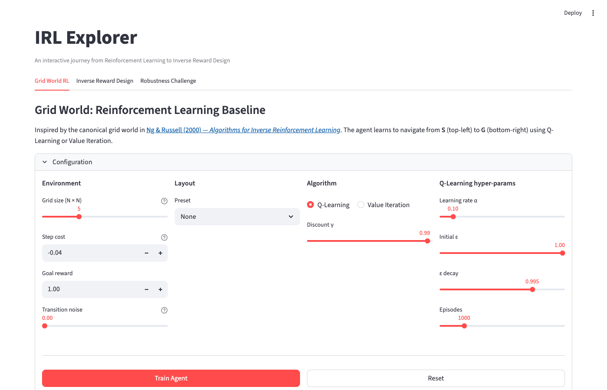
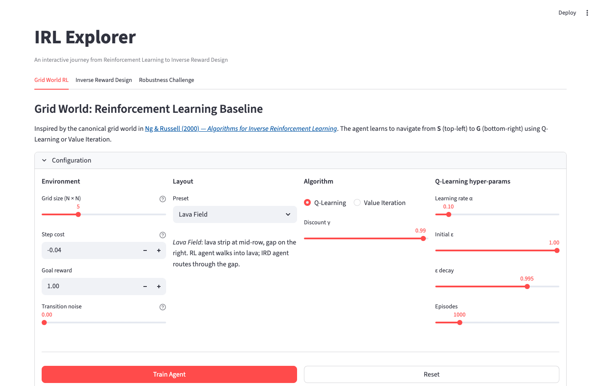
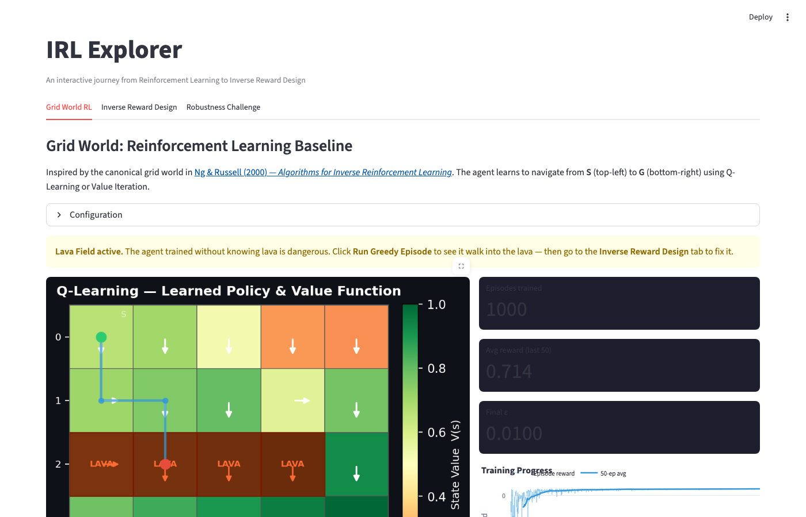
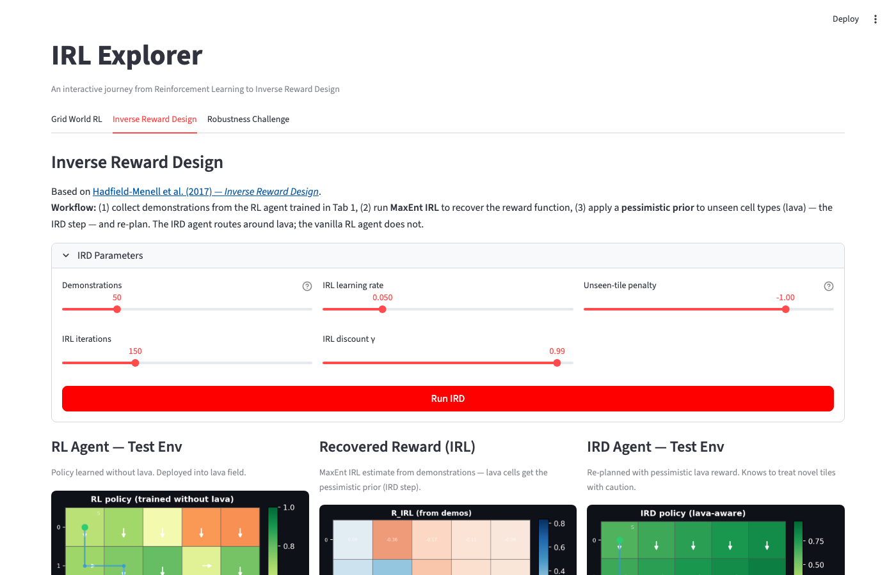
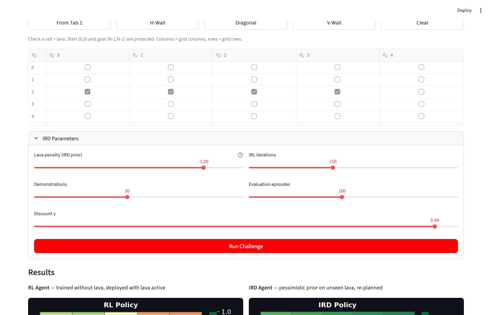

# IRL Explorer

An interactive Streamlit app that walks through the full pipeline from **Reinforcement Learning** to **Inverse Reinforcement Learning** to **Inverse Reward Design** — all in a configurable grid world.

The core problem: an RL agent trained in a clean environment knows nothing about novel hazards (lava, mud, ice) it might encounter at test time. This project lets you watch that failure happen, recover the agent's implicit reward function via MaxEnt IRL (Ziebart et al. 2008), and then fix the policy using a pessimistic prior on unseen cell types — the key idea from Inverse Reward Design (Hadfield-Menell et al. 2017).

---

## Live demo

**[irddemo-em7lb77xqmt2qvgnkqpmzf.streamlit.app](https://irddemo-em7lb77xqmt2qvgnkqpmzf.streamlit.app)**

> Free tier — may take ~20 s to wake from sleep on first visit.

---

## Screenshots

### Tab 1 — Grid World RL: layout preview


### Tab 1 — Grid World RL: trained policy


### Tab 1 — Grid World RL: Lava Field (agent walks into lava)


### Tab 2 — Inverse Reward Design: three-column comparison


### Tab 2 — Inverse Reward Design: reward heatmaps + IRL convergence


### Tab 3 — Robustness Challenge: custom lava layout + batch results


---

## Features

| Feature | Description |
|---------|-------------|
| **Grid World RL** | Train a Q-Learning or Value Iteration agent on a configurable N×N grid. Adjust step cost, goal reward, transition noise, and choose from five obstacle/lava presets. Visualise the learned policy (arrows) and value function (colour heatmap). Run greedy episodes and watch the agent succeed — or walk straight into lava. |
| **Inverse Reward Design** | Collect demonstrations from the trained agent, run MaxEnt IRL to recover the implied reward, apply a pessimistic penalty to unseen lava cells (the IRD step), and re-plan. A three-column side-by-side shows the RL agent dying, the recovered IRL reward heatmap, and the IRD agent routing safely around lava. |
| **Robustness Challenge** | Design your own lava layout using a grid editor, pick from H-wall / V-wall / diagonal presets, and run a batch evaluation (up to 200 episodes each) comparing RL vs. IRD success rates, average reward, and steps. |
| **Configurable environments** | Grid sizes from 3×3 to 10×10. Five obstacle presets (Horizontal Wall, Vertical Wall, Complex Maze, Zigzag Walls, Lava Field). Tunable transition noise, discount factor, Q-Learning hyperparameters. |
| **Multiple tile types** | Lava (terminal hazard), mud (multiplied step cost), ice (stochastic slip). Each tile type can be toggled on/off at evaluation time independently of training. |

---

## Setup

```bash
git clone https://github.com/boonin123/IRD_Demo.git
cd IRD_Demo

python -m venv .venv
source .venv/bin/activate        # Windows: .venv\Scripts\activate
pip install -r requirements.txt
```

## Running locally

```bash
streamlit run app.py
# → http://localhost:8501
```

---

## Walkthrough

The intended flow is linear across the three tabs:

**1. Grid World RL tab**
- Choose a grid size, obstacle preset, and algorithm (Q-Learning or Value Iteration).
- For the clearest IRD demonstration, select **Lava Field** — a horizontal lava strip across the middle row with a gap at the far-right column.
- Click **Train Agent**. The grid updates with the learned policy and value function.
- Click **Run Greedy Episode**. The RL agent (trained with `lava_active=False`) walks straight into the lava strip.

**2. Inverse Reward Design tab**
- Set the number of demonstrations, IRL iterations, and unseen-tile penalty.
- Click **Run IRD**. The app collects greedy rollouts, runs MaxEnt IRL to recover R(s), applies the pessimistic lava prior, and re-plans via Value Iteration.
- The three-column output shows: RL agent dying · recovered reward heatmaps · IRD agent routing through the safe gap.

**3. Robustness Challenge tab**
- Place lava freely using the grid editor or load a preset.
- Click **Run Challenge** to batch-evaluate both agents across N episodes.
- Compare success rates, lava-death rates, and average rewards side-by-side.

---

## Project structure

```
IRD_Demo/
├── app.py           # Streamlit entry point — three tabs wired together
├── agents.py        # QLearningAgent, ValueIterationAgent
├── gridworld.py     # GridWorld environment (stochastic, multi-tile-type)
├── irl.py           # MaxEnt IRL, soft value iteration, ird_reward, plan_with_reward
└── requirements.txt
```

---

## Tech stack

| Layer | Technology |
|-------|-----------|
| UI | Streamlit |
| RL / IRL | Python + NumPy (pure tabular) |
| Grid visualisation | Matplotlib |
| Charts | Plotly |
| Data editor | Pandas + Streamlit `st.data_editor` |

---

## References

- Ng, A. Y. & Russell, S. J. (2000). [Algorithms for Inverse Reinforcement Learning](https://ai.stanford.edu/~ang/papers/icml00-irl.pdf). *ICML*.
- Ziebart, B. D., Maas, A., Bagnell, J. A., & Dey, A. K. (2008). [Maximum Entropy Inverse Reinforcement Learning](https://cdn.aaai.org/AAAI/2008/AAAI08-227.pdf). *AAAI*.
- Hadfield-Menell, D., Milli, S., Abbeel, P., Russell, S., & Dragan, A. (2017). [Inverse Reward Design](https://arxiv.org/abs/1711.02827). *NeurIPS*.
